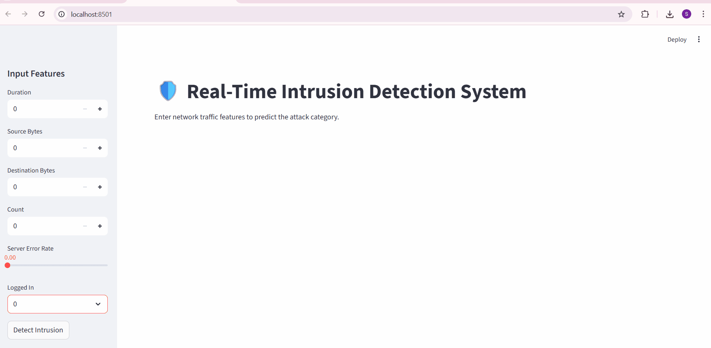
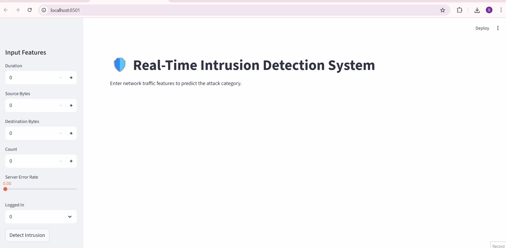

# 🛡️ Real-Time Intrusion Detection System

A complete, end-to-end Machine Learning application that detects network intrusions in real-time. This project goes beyond a simple model to include a robust FastAPI backend, automated Pytest testing, and an interactive Streamlit dashboard for live demonstrations.

## ✨ Key Features

* **High-Accuracy Model:** Utilizes a `RandomForestClassifier` trained on the NSL-KDD dataset to accurately identify various types of network attacks.
* **Real-Time API:** A high-performance REST API built with **FastAPI** serves the model's predictions instantly.
* **Interactive Dashboard:** A user-friendly web interface created with **Streamlit** allows for live testing and demonstration of the system's capabilities.
* **Automated Testing:** A full test suite using **Pytest** ensures the API is reliable and functions as expected.
* **Professional Tooling:** The project is version-controlled with **Git** and handles large data files correctly using **Git LFS**.

## 🚀 Live Demo

Here are two demos of the interactive dashboard in action.

#### **Detecting Normal Traffic**
The system correctly identifies safe network activity and classifies it as "Normal".

#### **Detecting a DoS Attack**
The system correctly identifies a classic Denial of Service (DoS) attack signature and raises a "Critical Alert".

## 🛠️ Tech Stack

* **Model Development:** Python, Pandas, Scikit-learn
* **API:** FastAPI, Uvicorn
* **Frontend:** Streamlit
* **Testing:** Pytest
* **Version Control:** Git, Git LFS

## ⚙️ How to Run

1.  Clone the repository.
2.  Create a virtual environment and activate it.
3.  Install dependencies: `pip install -r requirements.txt`
4.  Run the API server: `uvicorn api:app --reload`
5.  In a new terminal, run the dashboard: `streamlit run dashboard.py`

---